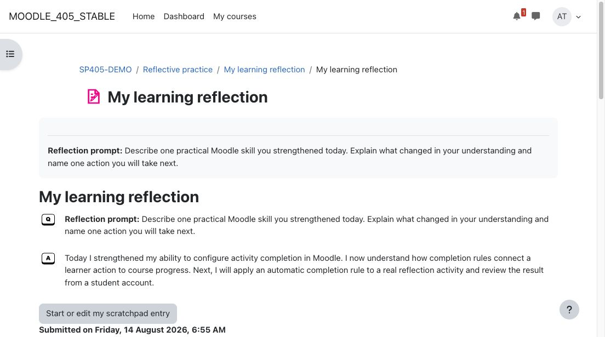
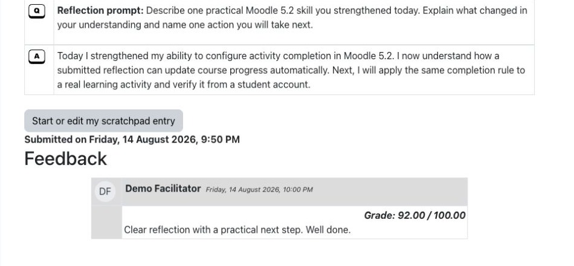
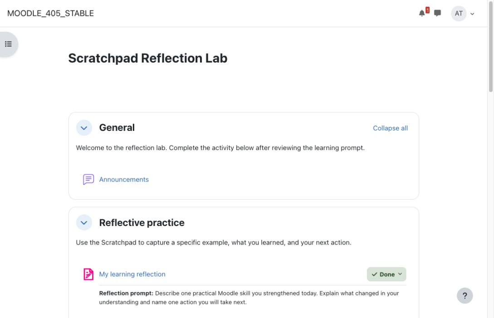
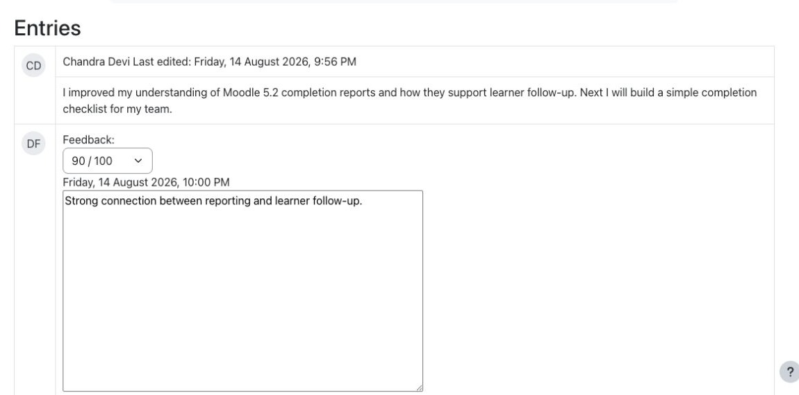
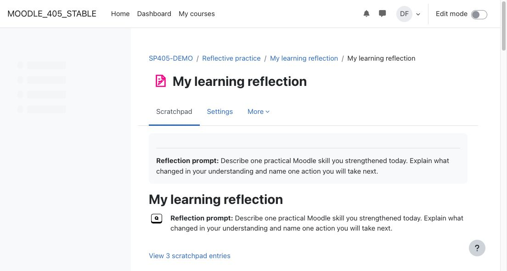

# Scratchpad activity

Scratchpad gives Moodle learners a focused private reflection space while giving teachers one workflow for reviewing entries, awarding grades, writing feedback, and using answers in activity completion.

## Key features

- Present a teacher-defined reflection prompt and one private learner response.
- Let learners return to edit their entry.
- Bring submitted entries, grades, and written feedback into a consolidated teacher report.
- Display reviewed grades and feedback with the learner's reflection.
- Support answer-based activity completion and Moodle gradebook integration.
- Provide download output suitable for saving reflections as PDF.
- Include Moodle backup, restore, mobile service, events, and Privacy API support.

## Screenshots

### Learner reflection

*The prompt and response remain together in the learner view. All people, courses, and reflection content shown are fictional demonstration data.*

### Learner feedback

*Reviewed feedback appears beneath the learner's reflection. All people, courses, grades, and reflection content shown are fictional demonstration data.*

### Course completion

*Scratchpad can contribute to Moodle course progress after a response is submitted. All people, courses, and completion data shown are fictional demonstration data.*

### Teacher grading

*The teacher report combines the response, grade selector, and feedback field. All people, courses, grades, and reflection content shown are fictional demonstration data.*

### Teacher overview

*The activity overview shows how many entries are ready for review. All people, courses, and submission data shown are fictional demonstration data.*

## Requirements

- Moodle 5.2.
- A course in which a teacher can add activities and learners can submit responses.
- No external service or additional Moodle plugin is required.

## Installation

Download the Scratchpad ZIP from its verified [Moodle Marketplace listing](https://marketplace.moodle.com/plugins/mod_scratchpad). In Moodle, open **Site administration > Plugins > Install plugins**, upload the ZIP, complete validation, and follow the displayed upgrade steps.

## Configuration and use

### Add a Scratchpad activity

Turn editing on in a course, choose **Add an activity or resource**, select **Scratchpad**, then set the activity name, reflection question, grading, availability, and completion conditions. Save the activity and review the learner view.

### Learner workflow

The learner opens the activity, reads the prompt, enters or updates a reflection, and saves it. If the activity uses answer-based completion, Moodle marks it complete after the required response is submitted.

### Teacher workflow

Open the activity report to review entries. Select a grade and enter written feedback for each learner, then save the review so the result appears in the learner view and Moodle gradebook where configured.

## Privacy and permissions

Scratchpad stores learner entry text, teacher feedback, ratings, and related user identifiers in Moodle. Its Privacy API provider declares the data, exports it for privacy requests, and supports deletion. The plugin does not send this information to an external service.

Moodle capabilities control activity viewing, entry management, reporting, grading, and downloads. Administrators should apply normal course roles, retention, backup, and privacy policies to Scratchpad activities.

## Troubleshooting

- If a learner cannot enter a response, confirm enrolment, activity availability, and the relevant Scratchpad capability.
- If completion does not update, confirm that course completion is enabled and the activity completion condition requires a response.
- If feedback is not visible, confirm that the review was saved and the learner is opening the correct activity.
- If a download is incomplete, check that the response and feedback have been saved before using the download option.

## Support and licence

- [Report a Scratchpad product issue](https://github.com/PukunuiMalaysia/moodle-docs/issues/new?template=product-bug.yml)
- [Request a Scratchpad feature](https://github.com/PukunuiMalaysia/moodle-docs/issues/new?template=feature.yml)
- [Report a documentation issue](https://github.com/PukunuiMalaysia/moodle-docs/issues/new?template=documentation.yml)
- [Pukunui Plugin Subscription Terms & Support Policy](https://pukunui.com/docs/policy-moodle-marketplace/)
- [Pukunui Malaysia](https://pukunui.com/location/malaysia/)

Scratchpad is licensed under the GNU General Public License v3 or later. This documentation is licensed under [CC BY 4.0](https://creativecommons.org/licenses/by/4.0/).
